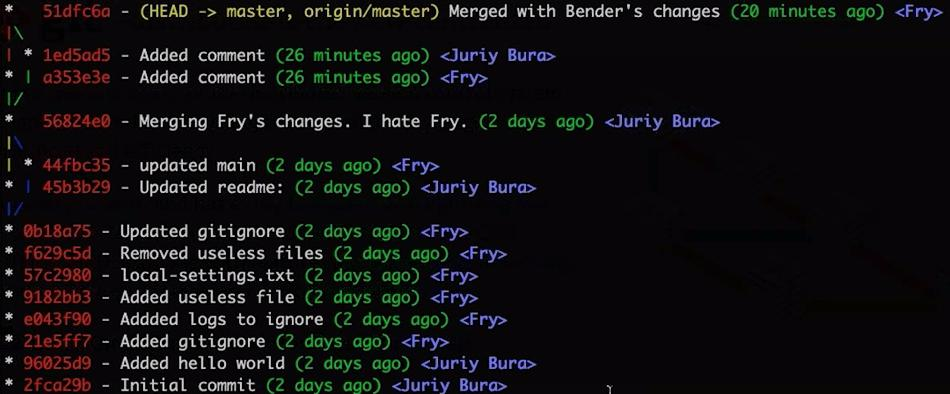

(*) - условная метка коммита

### 1) Создать Git репозиторий Alpha. 
Установить значения для имени юзера и почты в локальной конфигурации Git.
Создать файл index.html с содержимым:
```
<html>
<head>
	<title>Hello gt<title>
</head>
<body>
	First git repo
</body>
</html>
```

Добавить файл в index, закоммитить (m1) изменения.

Создать файл styles.css с содержимым:
```
body {
	background-color: #ccc;
	font-size: 15px;
}
```

Добавить файл в index, закоммитить (m2) изменения.
Проверить лог.

### 2) Создать ветку js-feature. 
Создать ветку title-fix и переключиться на нее. 
Исправить файл index.html. 

```
- <title>Hello gt<title>
+ <title>Hello git<title>
```

Добавить и закоммитить (tf1) багфикс.


Вернуться на ветку master. Добавить в файл index.html следующий код:

```
<body>
	First git repo
	+ Prepare to first merge
</body>
```
Добавить и закоммитить(m3) изменения.
Смержить ветку title-fix в ветку master. (m4)

### 3) Поработать с командой git log, сконфигурировать команду таким образом, чтобы вывод соответствовал:


### 4) Сконфигурировать алиасы для следующих команд:
* Вывод форматированного лога (см. 3)
* git checkout -b
* git commit -am

### 5) Откатится в ветке master, на коммит (m3). 
Изменить файл index.html следующим образом:
```
<body>
	First git repo
	- Prepare to first merge
	+ Prepare to first rebase
</body>
```
Добавить и закоммитить(m5) изменения.

Для текущей ветки master объединить два последних коммита m3 и m5 в один коммит (m6).

### 6) Применить коммит из ветки title-fix на ветку master. 

### 7) Переключиться на ветку js-feature. 
Добавить в файл index.html следующий код:
```
<head>
<title>Hello gt<title>
+ <script>console.log("hello git!")</script>
</head>
```

Добавить и закоммитить код (jf1).

Переместить коммиты из ветки master в ветку js-feature.
Создать ветку js-feature-old, указатель ветки поместить на коммит jf1. 

### 8) Создать remote репозиторий. Удаленный на github/bitbucket или в файловой системе. 
Залить в репозиторий все локальные ветки из репозитория Alpha.
Клонировать удаленный репозиторий в еще один локальный репозиторий (Sigma). 

В репозитории Alpha откатить ветку js-feature на 3 коммита назад и залить ее в удаленный репозиторий. 

### 9) В Alpha установить tag на предпоследний коммит в ветке master.
В Sigma переключиться на установленный ранее tag.

### 10) Удалить ветку js-feature-old с удаленного репозитория при помощи консоли.

### 1) В Alpha, в ветке title-fix, добавить следующий код:

```
- <title>Hello git<title>
+ <title>Hello git, goodbye SVN<title>
```

Не коммитя изменения, переключиться на ветку master. 
Удалить файл style.css, закоммитить изменения. 
Вернуться на ветку title-fix и закоммитить ранее сделанные изменения. 


